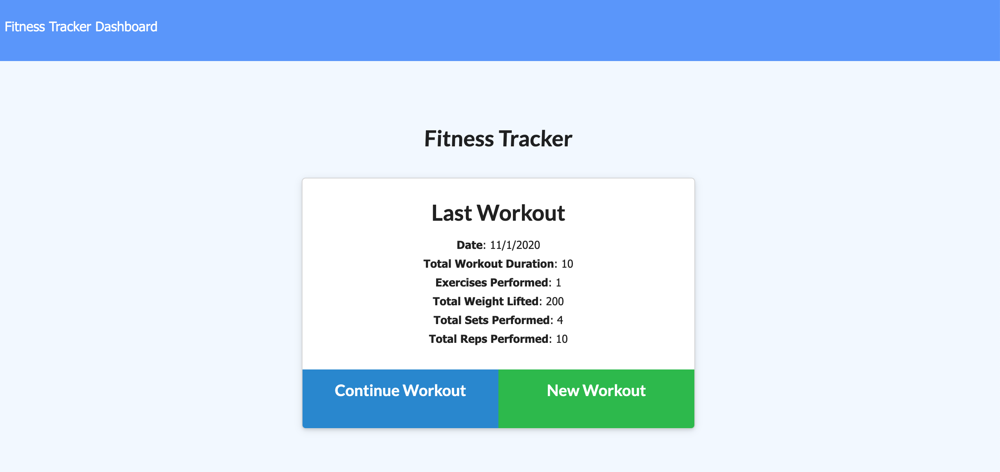

# Fitness Tracker #
  

  
  ## View Program ##
  
  

  * [Heroku Link](https://frightful-mansion-03263.herokuapp.com/?id=5f9f18201970f6001737575c)

  ## Description ##

  Web application to record your workouts, save or complete them, and then follow your progress through the cart tracker.

  ## Table Of Contents ##

  - [Description](#Description)
  - [Installation](#Installation)
  - [Usage](#Usage)
  - [Contributors](#Contributors)
  - [License](#License)
  - [Tests](#Tests)
  - [Repository](#Repository)
  - [Questions](#Questions)

  ## Installation ##

  1. Open through Heroku
 
  ## Usage ##

  1. Select create workout
  1. Choose between cardio and resistance and fill out the information
  1. Add workout to your plan, click complete when finished
  1. Navigate to the dashboard to check your progress and results.

  ## Contributors ##
  * [Aaron Platt](https://github.com/aaronkplatt)
  * [Matthew Rogers](https://github.com/Rogers-Development-Services)
  * [Nancy Lambert-Brown](https://github.com/n-lambert)
  * [Plover Brown](https://github.com/rebgrasshopper)
  * [Nicholas Konzen](https://github.com/NTKonzen)
  * [Talia Vazquez](https://github.com/taliavazquez)
  * [ShieldsIO](https://shields.io/category/license) 
  * [Nodejs.org](https://nodejs.org/en/)
  * [MongoDB]
  * [Express]
  ## License ##

  https://api.github.com/licenses/mit

  ## Tests ##

  Using jest or mocha you can run tests through the application using npm test.

  ## Repository ##

  - [My Projects Repository](https://github.com/tbsanders5/fitnesstracker)

  ## Questions ##

  
  - Timothy Sanders
  - [My Profile](https://github.com/tbsanders5)
  - tbsanders5@gmail.com